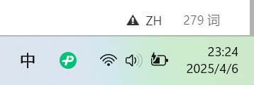

# 向量

## 一、基础

1. 所有R对象都有其属性，其最重要的两个属性:**_<u>类型(typeof(x))与长度(length(x))</u>_**

2. 标量：单个数值是向量的一种特例。

3. :eagle:==元素的数据类型是统一的，可以是整形，数值型（浮点数），字符型（字符串），逻辑型，复数型等等。==

4. 向量的索引从1开始，连续存储，不能插入或删除，若要添加或删除元素，重新给向量赋值。

	```R
	x<-c(88,5,12,13)
	#将168插到13的前面
	x<-c(x[1:3],168，x[4])
	```

5. length()获取向量长度.

## 二、自动补齐

在要求这两个向量具有相同的长度，R会自动重复较短的向量，直到它与另外一个向量长度匹配

```R
#矩阵在R中按列存储
> x<-matrix(c(1,2,3,4,5,6),nrow=3)
> View(x)
> x+c(1,2)
     [,1] [,2]
[1,]    2    6
[2,]    4    6
[3,]    4    8
```

$$
x+c(1,2)=\begin{bmatrix}
1 & 4 \\
2 & 5 \\
3 & 6 \\
\end{bmatrix}+\begin{bmatrix}
1 & 2 \\
2 & 1 \\
1 & 2 \\
\end{bmatrix}
$$

### 三、常用操作


